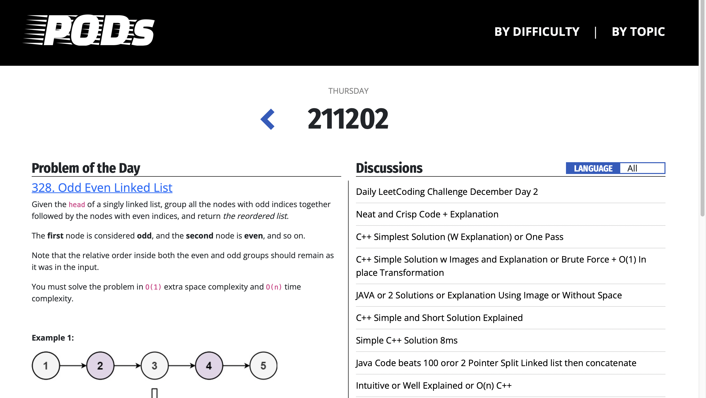

# PODs
   
Problems Of the Day : Recommend new algorithm problems everyday  
  
By scrapping online judge websites like [Baekjoon](https://www.acmicpc.net) and [Leetcode](https://leetcode.com), we recommand one problem daily.

## Screenshot


## Dev, Build, Deply options
### Developing
#### UI Development
```
./run.sh --ui-dev
```
#### API Development
```
./run.sh --api-dev
```
#### Integrated Development
```
./run.sh --dev
```
### Building
#### UI Build
```
./run.sh --build-ui
```
#### Integrated Build
```
./run.sh --build
```
### Deploy
```
./run.sh --release
```
## Contribute
Plz read & follow [Conventions for our project](./CONVENTIONS.md)   
